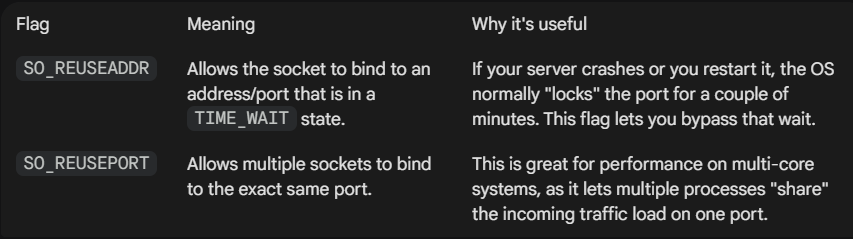

# Socket Programming - Server Side

## 1. socket()

Think of a socket as a phone jack on a wall. The `socket()` function is what you use to actually "install" that jack so you can eventually plug in a cord and make a call.

--- 
### The `socket()` Function Syntax
To use it, you need to `include <sys/socket.h>`. The function signature looks like this:

```cpp
int socket(int domain, int type, int protocol);
```

Parameters Breakdown:
|Parameter|What it defines|Common Values|
|:-------:|:-------------:|:-----------:|
|`domain`|The communication medium (Protocol Family).|`AF_INET` (IPv4) or `AF_INET6` (IPv6).|
|`type`|The style of communication.|`SOCK_STREAM` (TCP) or `SOCK_DGRAM` (UDP).|
|`protocol`|Specific protocol to be used.|Usually set to 0 to let the OS choose the default for the type.|


Return Value
- **Success**: Returns a **File Descriptor** (a small non-negative integer). In Unix-like systems, "everything is a file," so you interact with a network connection just like you would a text file.

- **Failure**: Returns -1.
---

### How it Fits into the Workflow
The socket() call is only the first step. Depending on whether you are building a Server or a Client, the journey looks a bit different:

- The Server Side
  - `socket()`: Create the socket.
  - `bind()`: Assign an IP address and Port to the socket.
  - `listen()`: Wait for a client to "knock" on the door.
  - `accept()`: Open the door and establish the connection.

- The Client Side
  - `socket()`: Create the socket.
  - `connect()`: Attempt to link up with the server's IP and Port.
---
### Simple Code Example (C++)

Here is how you would initialize a basic TCP socket for IPv4:

```cpp
#include <iostream>
#include <sys/socket.h>
#include <netinet/in.h>
#include <unistd.h>

int main() {
    // 1. Create the socket
    int server_fd = socket(AF_INET, SOCK_STREAM, 0);

    if (server_fd < 0) {
        std::cerr << "Socket creation failed!" << std::endl;
        return -1;
    }

    std::cout << "Socket created successfully with FD: " << server_fd << std::endl;

    // Don't forget to close it when done!
    close(server_fd);
    return 0;
}
```

## 2. bind()

After you've created a "phone jack" with socket(), the computer knows it has a communication point, but it doesn't know its "phone number" yet.

The bind() function is what assigns a specific IP address and Port number to that socket. This is essential for servers because clients need to know exactly which address and port to connect to.

---

### The `bind()` Function Syntax
```cpp
int bind(int sockfd, const struct sockaddr *addr, socklen_t addrlen);
```
**Parameters Breakdown**

- **sockfd**: The file descriptor returned by the previous `socket()` call.
- **addr**: A pointer to a structure (`sockaddr_in`) containing the IP and Port you want to use.
- **addrlen**: The size (in bytes) of that address structure.

**Return Value**
- **Success**: 0
- **Failure**: -1 (Commonly happens if the port is already in use or if you don't have permission to use a privileged port—usually those below 1024).

--- 

### Why is it necessary?
Imagine a building (your computer) with thousands of doors (ports).

- Without `bind()`: You have a socket, but it's just floating in the building. No one knows which door leads to your application.

- With `bind()`: You tell the OS, "Any traffic coming to Port **8080** should be sent to this specific socket."

--- 

### Implementation Example
In C++, you usually use `struct sockaddr_in` to make setting the address easier, then cast it to the generic `sockaddr` pointer.
```cpp
#include <sys/socket.h>
#include <netinet/in.h>

// ... inside main ...

int server_fd = socket(AF_INET, SOCK_STREAM, 0);

struct sockaddr_in address;
address.sin_family = AF_INET;         // IPv4
address.sin_addr.s_addr = INADDR_ANY; // Bind to any available network interface
address.sin_port = htons(8080);       // Bind to port 8080 (htons converts to network byte order)

if (bind(server_fd, (struct sockaddr *)&address, sizeof(address)) < 0) {
    perror("Bind failed");
    return -1;
}
```

### Important Point
1. Network Byte Order: Computers store numbers differently (Big-endian vs Little-endian). Functions like `htons()` (Host TO Network Short) are required to ensure the port number is readable by the network hardware.

2. `INADDR_ANY`: This is a special constant that tells the server to listen on all available network interfaces (WiFi, Ethernet, etc.). If you only wanted to allow connections from the same machine, you would bind to `127.0.0.1`.

3. **Port Reuse**: If you stop your program and try to restart it immediately, `bind()` might fail with "Address already in use." This is because the OS keeps the port in a `TIME_WAIT` state. You can bypass this using the `SO_REUSEADDR` socket option.
```cpp
    if (setsockopt(server_fd, SOL_SOCKET, SO_REUSEADDR | SO_REUSEPORT, &opt, sizeof(opt))) {
        perror("setsockopt failed");
        exit(EXIT_FAILURE);
    }
```


\* **Note**  
When you're developing and testing network code, you'll quickly run into a frustrating issue: you stop your program, try to run it again, and get a "Bind failed: Address already in use" error.

This happens because the Operating System holds the port in a "cleanup" state for a minute or two. `setsockopt()` allows you to tell the OS to ignore that and let you reuse the port immediately.

Learn more about this in [setsockopt](https://www.tutorialspoint.com/unix_system_calls/setsockopt.htm).

## 3. listen()

In network programming, `listen()` is the function that transforms a "passive" socket into a "listening" socket.

If `socket()` creates the phone and `bind()` gives it a phone number, `listen()` is the act of turning the ringer on and waiting for it to ring.

---

### The `listen()` Syntax

```cpp
#include <sys/socket.h>

int listen(int sockfd, int backlog);
```

**Parameters**
- `sockfd`: The file descriptor of the socket (the one you already created and bound).

- `backlog`: This is the "waiting room" size. It defines the maximum number of pending connections that can queue up. If a client tries to connect while the queue is full, they will receive a "Connection Refused" error.

**Return Value**
- 0: Success.
- -1: Failure (you can check `errno` for the specific reason).

---

### Where it fits in the Server Lifecycle
The `listen()` call is strictly for Servers. A client will never call `listen()` because a client initiates the connection rather than waiting for one.

1. `socket()`: Create the socket.
2. `bind()`: Assign the IP and Port.
3. `listen()`: Start waiting for connections (the socket enters the `LISTEN` state).
4. `accept()`: Pick up the "ringing phone" to start the conversation.

---

### Implementation Example

```cpp
#include <iostream>
#include <sys/socket.h>
#include <netinet/in.h>

int main() {
    int server_fd = socket(AF_INET, SOCK_STREAM, 0);
    
    // ... setup address and call bind() ...

    // Start listening with a backlog of 10
    if (listen(server_fd, 10) < 0) {
        perror("listen failed");
        return -1;
    }

    std::cout << "Server is now listening for incoming connections..." << std::endl;

    return 0;
}
```
---

### Important Points
- **Non-Blocking**: `listen()` itself doesn't "pause" your program. It just tells the Operating System kernel to start accepting connection requests in the background.

- **The Backlog Queue**: In modern Linux, if you set the backlog to `0`, the kernel might still allow a few connections, but it's best to set a reasonable number (like 5 or 10) for small projects, or use the system limit SOMAXCONN for high-traffic servers.

- **State Change**: After this call, if you run the command `netstat -ant` in your terminal, you will see your program's port listed with the state `LISTEN`.

## 4. accept()
After you've called `listen()`, your server is waiting for a "knock" on the door. The `accept()` function is what actually opens that door to let the client in.

In the phone analogy: `listen()` is the phone ringing; `accept()` is you picking up the receiver to start the conversation.

---

### The accept() Function Syntax
```cpp
int accept(int sockfd, struct sockaddr *addr, socklen_t *addrlen);
```

**Parameters Breakdown**
- `sockfd`: The "Listening" socket (the one you used for `bind()` and `listen()`).
- `addr`: A pointer to a `sockaddr` structure. The OS will fill this in with the client's information (their IP address and port).
- `addrlen`: A pointer to an integer containing the size of the address structure. The OS updates this to the actual size of the client's address.

**Return Value (Crucial!)**
- Success: It returns a brand new file descriptor.
  - The original `sockfd` stays open and continues listening for more clients.
  - The new file descriptor is used exclusively for communicating with the specific client that just connected.

- Failure: Returns `-1`.

---

### Why does it return a new socket?
This is one of the most important concepts in network programming.

Imagine a busy restaurant.
- The Listening Socket (`server_fd`) is the host/hostess at the front door. Their only job is to greet people and tell them where to go.
- The Connected Socket (the return value of `accept`) is the waiter assigned to your table.

Because `accept()` gives you a new socket for every client, a server can handle multiple people at once. The host stays at the door (`server_fd`), while different waiters (new socket FDs) handle the conversations at the tables.

---

### Implementation Example
Here is how the code looks when you finally "pick up the phone":
```cpp
#include <sys/socket.h>
#include <netinet/in.h>
#include <unistd.h>
#include <iostream>

// ... assuming socket, bind, and listen are already done ...

struct sockaddr_in client_addr;
socklen_t addr_size = sizeof(client_addr);

// This call BLOCKS (pauses your program) until someone connects
int client_socket = accept(server_fd, (struct sockaddr *)&client_addr, &addr_size);

if (client_socket < 0) {
    perror("Accept failed");
    return -1;
}

std::cout << "Connection accepted! We can now talk to the client." << std::endl;

// Now you use client_socket (NOT server_fd) to send/receive data
char buffer[1024] = "Hello from Server!";
send(client_socket, buffer, sizeof(buffer), 0);

// Close the client connection when done
close(client_socket);
```

### Important Points
- Blocking: By default, `accept()` is a "blocking" call. Your program will literally stop and sit at that line of code forever until a client actually connects.

- Information Gathering: If you don't care about the client's IP address, you can pass `NULL` for the second and third parameters: `accept(server_fd, NULL, NULL)`;.

- The Queue: `accept()` pulls the very first connection request out of the backlog queue (the "3" or "10" you defined in `listen()`).


---

### **How to run Day 1 Server.**
```bash
    cd Progress_Update/day1
    g++ server.cpp -o server.exe
    ./server.exe

    # in new terminal
    nc localhost 8080
    # as we have not written the client side code
```
